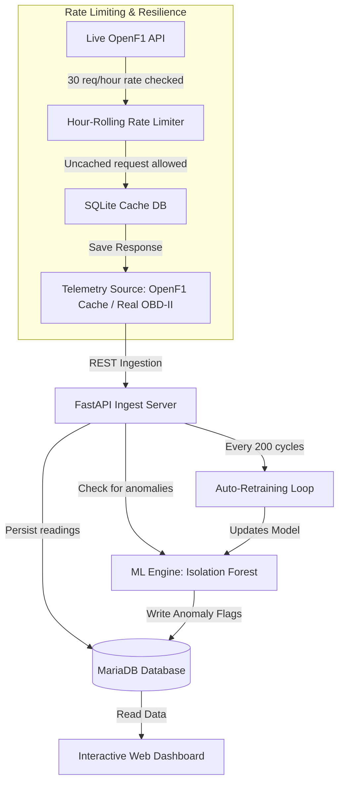
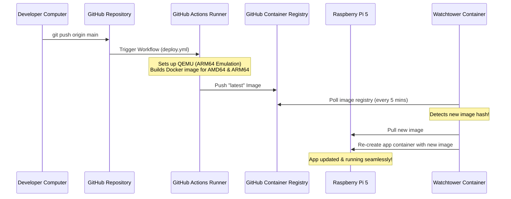

# System Architecture & Raspberry Pi 5 Deployment Guide

Welcome to the **Why is it Blinking?** system guide. This document explains the architecture of the new version, the technology stack, the automated CI/CD pipeline, and provides a complete, step-by-step guide to setting up and hosting the application on a **Raspberry Pi 5** from scratch.

---

## 1. What the New Version Does & System Workflow

This platform processes OBD/vehicle telematics data, runs machine learning anomaly detection to flag potential engine or electrical faults, and visualizes live system health. 

### The Workflow:


1. **Telemetry Stream**: A background thread in the app fetches vehicle data. By default, it reads high-resolution racing telematics (RPM, speed, throttle, gear, temperatures) from our cached database.
2. **Ingestion & DB Entry**: Data is formatted and saved to the MariaDB database. If MariaDB is starting up or offline, the app automatically falls back to a local SQLite file so it never crashes.
3. **ML Anomaly Detection**: Every reading is evaluated by an Isolation Forest machine learning model. If metrics diverge from normal behavior (e.g., abnormally high coolant temperature relative to speed/load), an anomaly record is logged.
4. **Interactive Dashboard**: Users view real-time dials, historical charts, stats, and a list of active alerts through a premium web dashboard interface.
5. **Auto-Retraining**: The ML model dynamically retrains itself every 200 readings based on incoming data to adapt to the specific vehicle's behavior.

---

## 2. Technology Stack & Tools Used

- **Framework**: FastAPI (Python) - Async, high-performance web API framework.
- **Database (Primary)**: MariaDB 10.11 (MySQL-compatible) - Persistent storage for telemetry and anomaly logs.
- **Database (Cache & Fallback)**: SQLite 3 - Handles offline cache for API data and functions as an emergency database backup.
- **Data & ML Libraries**: 
  - **Pandas**: Data cleaning and aggregation.
  - **Scikit-Learn**: isolation Forest unsupervised anomaly detection.
- **Deployment**: Docker & Docker Compose - Standardized, isolated container environments.
- **CI/CD Pipeline**: GitHub Actions - Automated compilation of multi-arch images.
- **Auto-Updater**: Watchtower - Pulls new Docker images and restarts containers automatically.

---

## 3. How the CI/CD Pipeline & Auto-Update Work



### Explaining `deploy.yml` (How it works):
1. **Trigger**: Whenever you run `git push` to the `main` branch on GitHub, the workflow in `.github/workflows/deploy.yml` starts.
2. **Environment**: It runs on an Ubuntu runner hosted by GitHub.
3. **Multi-Architecture Setup (QEMU & Buildx)**:
   - Raspberry Pi 5 uses an **ARM64** processor, while GitHub's runners use **x86_64 (AMD64)**.
   - The workflow runs **QEMU emulator** inside the runner so it can compile ARM64 code on an x86 server.
   - It sets up **Docker Buildx**, a builder utility that compiles the application code for both `linux/amd64` (laptops) and `linux/arm64` (Raspberry Pi).
4. **Registry Authentication**: Logins to **GitHub Container Registry (GHCR)** using your repo's secure `GITHUB_TOKEN`.
5. **Metadata Extraction**: Lowercases the repository name (Docker registry images must be strictly lowercase) and tags the image with `latest`.
6. **Build & Push**: Compiles the multi-arch Docker image, caches the intermediate layers to speed up future runs, and pushes it to `ghcr.io`.

### Explaining Watchtower (How the auto-update works):
Your Raspberry Pi runs a helper container named `telemetry_watchtower`.
- Every 5 minutes (300 seconds), Watchtower silently queries GHCR (`ghcr.io`) to see if the image hash for `whyisitblinking:latest` has changed.
- If a new version is pushed by GitHub Actions, Watchtower:
  1. Pulls the new ARM64 image down to your Raspberry Pi.
  2. Gracefully stops the running `telemetry_app` container.
  3. Recreates the container with the exact same volumes and network settings.
  4. Deletes the old image to free up disk space on the Pi.
This happens completely automatically. You push to GitHub, and 5 minutes later your Raspberry Pi is running the updated code.

---

## 4. Raspberry Pi 5 Complete Setup Guide (From Scratch)

Follow this step-by-step checklist to set up your Raspberry Pi 5 and host the project.

### Step A: Flash Raspberry Pi OS
1. Insert a microSD card (16GB or larger) into your computer.
2. Download and open **Raspberry Pi Imager**.
3. Choose **Raspberry Pi 5** as the device.
4. Choose **Raspberry Pi OS (64-bit)** (Bookworm is recommended).
5. Click **Next** and configure OS Customization:
   - Set a hostname (e.g., `blinkingpi`).
   - Set a username and password.
   - Configure Wi-Fi details.
   - **Enable SSH** (under the Services tab, using password authentication).
6. Flash the OS.

### Step B: Connect and Update
1. Insert the microSD card into the Raspberry Pi 5 and power it on.
2. Open a terminal on your computer and connect to the Pi:
   ```bash
   ssh username@blinkingpi.local
   # Enter the password you configured in Raspberry Pi Imager
   ```
3. Update system packages:
   ```bash
   sudo apt update && sudo apt upgrade -y
   ```

### Step C: Install Docker and Docker Compose
1. Download and run the official Docker setup script:
   ```bash
   curl -fsSL https://get.docker.com -o get-docker.sh
   sudo sh get-docker.sh
   ```
2. Add your user account to the `docker` group so you can run container commands without typing `sudo`:
   ```bash
   sudo usermod -aG docker $USER
   ```
3. Apply the group change (or reboot):
   ```bash
   newgrp docker
   ```
4. Verify Docker is running:
   ```bash
   docker compose version
   ```

### Step D: Set up the Project
1. Clone your GitHub repository to your Raspberry Pi:
   ```bash
   git clone https://github.com/<your-username>/WhyIsItBlinking.git
   cd WhyIsItBlinking
   ```
2. Create your environment configuration file:
   ```bash
   # Copy the example file
   cp .env.example .env
   ```
3. Edit the `.env` file (you can use `nano .env`):
   ```ini
   DB_HOST=db
   DB_PORT=3306
   DB_USER=root
   DB_PASSWORD=ps04
   DB_NAME=vehicle_telemetry
   OBD_PORT=/dev/ttyUSB0
   ```
   *(Note: Set `DB_HOST=db` so the app connects to the container database.)*

### Step E: Start the Stack & Configure Autostart
1. Run Docker Compose to pull the pre-built images and spin up the database and dashboard:
   ```bash
   docker compose up -d
   ```
2. **Automating Startup (If the Pi restarts/turns off)**:
   - In our `docker-compose.yml`, both database and application services are configured with `restart: always`.
   - To ensure the Docker engine itself starts when the Raspberry Pi boots, enable the Docker system service:
     ```bash
     sudo systemctl enable docker.service
     sudo systemctl enable containerd.service
     ```
   - Now, if the Raspberry Pi loses power or is shut down, as soon as it boots back up, Docker will launch and automatically spin up the MariaDB, FastAPI Dashboard, and Watchtower services without any user login or command!

The dashboard should load immediately, running fully offline using the cached Bahrain Grand Prix data!
 To load it by just typing `whyisitblinking.ps` (without adding `:8000` at the end), change the ports mapping in your `docker-compose.yml`:
```yaml
  app:
    ...
    ports:
      - "80:8000"  # Route host HTTP port 80 to container port 8000
```
Run `docker compose up -d` on the Pi to apply this change.

#### Step B: Map the Domain Name to the Pi's IP Address
Choose one of these methods to make the name `whyisitblinking.ps` point to your Raspberry Pi:

* **Method 1: Local DNS (Highly Recommended if you use Pi-hole or AdGuard Home)**
  If you run Pi-hole, AdGuard Home, or have a smart router:
  1. Open your Pi-hole/AdGuard dashboard.
  2. Navigate to **Local DNS Records** -> **DNS Records**.
  3. Add a new record:
     - **Domain:** `whyisitblinking.ps`
     - **IP Address:** Your Raspberry Pi's local IP (e.g. `192.168.1.100`).
  4. Now, *every* device on your home Wi-Fi can resolve `whyisitblinking.ps` automatically!

* **Method 2: Edit Host Files (Fastest for testing on a single computer)**
  If you don't have a local DNS server, you can tell your individual computer how to find it:
  - **On Windows:**
    1. Open Notepad as Administrator.
    2. Open `C:\Windows\System32\drivers\etc\hosts`.
    3. Add this line at the bottom:
       ```
       <YOUR_RASPBERRY_PI_IP> whyisitblinking.ps
       ```
       *(Replace `<YOUR_RASPBERRY_PI_IP>` with your Pi's actual local IP address, e.g., `192.168.1.15`)*
    4. Save the file.
  - **On macOS / Linux:**
    1. Open terminal and run: `sudo nano /etc/hosts`
    2. Add the same line:
       ```
       <YOUR_RASPBERRY_PI_IP> whyisitblinking.ps
       ```
    3. Save and close (Ctrl+O, Enter, Ctrl+X).


